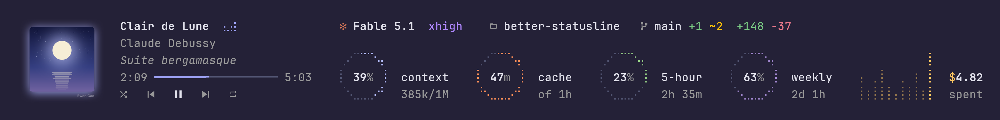
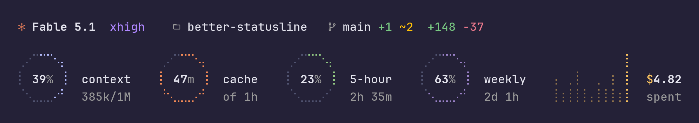
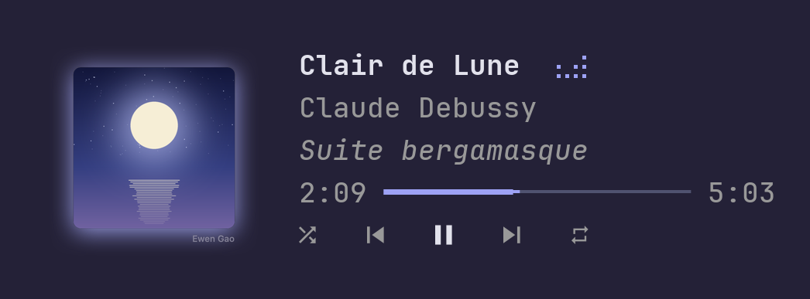

# better-statusline

A status line for [Claude Code](https://claude.com/claude-code), drawn above the prompt: the session's figures as dot-matrix rings, and the music you are playing beside them.



<sub>Drawn by the plugin's own code as Ghostty paints it, with sample figures and a cover made for the picture.</sub>

## What it shows



- **Header**: the model and its effort, the folder, the git branch with its staged and modified files, the lines the session added and removed, and the subagents at work.
- **Context**: how full the window is.
- **Cache**: the minutes left before the prompt cache goes cold, counted from the last response. An hour on a subscription inside its limits, five minutes otherwise.
- **5-hour and weekly**: how much of each limit is spent, and when it starts over. The arc turns yellow once you spend faster than the window passes.
- **Spend**: what each recent turn cost, beside the session's total.



On macOS a card shows what Spotify or Apple Music is playing. It takes the mouse: play, pause, skip, seek along the line, shuffle, repeat, and the volume at the right end of the controls.

`/fold` folds the whole band into one row, and opens it again.

## Requirements

| For | You need |
| --- | --- |
| The status | Claude Code 2.1.289 or later, and `git` |
| The music card | macOS with Spotify or Apple Music |
| Cover pictures | kitty 0.28 or later, or Ghostty; not through tmux, screen or ssh |
| Rings that are round at your font size | `python3`, and a terminal that reports its pixel size |
| Nerd Font icons | Ghostty, kitty or WezTerm, or your own Nerd Font |

Each missing piece takes only its own part away: without a player the band is the status alone, without pictures the card has no cover, without a Nerd Font the icons are plain Unicode.

The plugin is built on Claude Code's function hooks, an early-access API that still changes between releases. It is developed on macOS in Ghostty. The other terminals are handled by what each one reports, and are untested.

## Install

From the marketplace this repository carries:

```sh
claude plugin marketplace add Autumn1337/better-statusline
claude plugin install better-statusline@better-statusline
```

Or from a clone, for one session:

```sh
git clone https://github.com/Autumn1337/better-statusline
claude --plugin-dir ./better-statusline
```

To load a clone in every session, name its parent folder in `CLAUDE_CODE_PLUGIN_DIRS`, in the `env` block of `~/.claude/settings.json`.

## Options

Both are rows in `/config`.

| Option | Values | `auto` means |
| --- | --- | --- |
| `icons` | `auto`, `nerd`, `unicode` | Nerd Font icons in the terminals that carry them, Unicode in the rest |
| `motion` | `auto`, `full`, `reduced` | Follow macOS's Reduce Motion; move in full elsewhere |

## What it costs

At rest the band costs nothing you can measure. Each frame it draws is a redraw of the terminal's, so while music plays the meter's sway takes 3 to 4% of one core in every open session. `motion: reduced` holds it still.

## How it is built

```
hooks/register.tsx   every hook, and all that reaches the engine
hooks/*.ts           what the hooks compute: the status, the music, the terminal
ui/*.tsx             the three surface modules: the status, the card, the one-line player
ui/dots.ts           the dot drawings: rings, bars, lanes
bridge/              the scripts that reach the Mac: the players, the cover, the cell size
types/index.d.ts     the state the plugin keeps
```

The players reach the plugin through one contract: `bridge/now-playing.js` prints a line of JSON, a `MusicPlayer` as `types/index.d.ts` declares it, each time what plays changes. A bridge for another system, MPRIS on Linux say, needs only to print the same lines.

## Development

`claude --plugin-dir .` loads the plugin from its folder, reloads it on every save, and lays the engine's types under `.claude-plugin/types/`. Then:

```sh
claude plugin validate .
tsc -p .
```

## License

MIT © Ewen Gao
